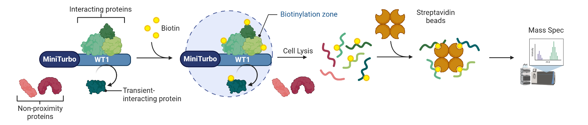

# Proximity-Labeling DEP Toolkit

## Introduction

Proximity-labeling (PL) proteomics is a technique for mapping a protein's
local interaction neighborhood in living cells. A promiscuous labeling
enzyme — a biotin ligase (BioID, TurboID) or engineered peroxidase (APEX) —
is fused to a bait protein of interest and expressed in cells. Upon
activation, the enzyme covalently tags proteins within a short radius with
biotin. Biotinylated proteins are then enriched with streptavidin beads,
digested, and identified/quantified by mass spectrometry, yielding a
snapshot of the bait's proximal interactome — including transient and
weak interactions that co-IP/AP-MS approaches often miss — rather than a
strict binary interaction list. Because labeling is spatial and
activity-driven rather than affinity-driven, the resulting quantitative
data has analytical characteristics (background labeling, bait/enzyme
activity variability, non-random missingness) that differ from standard
AP-MS data and shape most of this toolkit's design choices, described next.

### Bioinformatic limitations of proximity-labeling (BioID/TurboID/APEX) data

PL data poses several analytical challenges beyond standard AP-MS/expression
proteomics, which shape this toolkit's design:

- **Non-specific, stochastic biotinylation** blurs true interactors with
  background — needs stringent thresholds and control comparisons.
- **Streptavidin pulldown contaminants** (carboxylases, keratins) appear in
  every sample regardless of bait — needs CRAPome-style filtering.
- **MNAR-dominated missingness** — low-abundance proteins go missing
  non-randomly, requiring MNAR-aware imputation rather than plain kNN/mean.
- **Variable bait expression/enzyme activity across replicates** adds
  intensity shifts independent of true biology — requires normalization.
- **No single DEA method is robust alone** — different methods' assumptions
  make them differently sensitive to the noise above, motivating a
  multi-method consensus rather than one test.
- **Small replicate numbers**, typical of these experiments, further favor
  consensus scoring over strict single-test correction.

## Project Description

Variants in the transcription factor WT1 (Wilms tumor 1) cause severe,
progressive glomerulopathy marked by heavy proteinuria and progression to
end-stage kidney disease (ESKD). WT1 is expressed as two major isoforms,
WT1(+)KTS and WT1(-)KTS, distinguished by the inclusion or exclusion of
three amino acids (KTS) between the third and fourth zinc fingers; the two
isoforms have both overlapping and distinct functions. WT1 is known to
regulate the expression of many essential podocyte proteins, but its
transcriptional co-activators and co-repressors remain unidentified.

This project uses proximity-dependent labeling to define the WT1
interactome and to resolve the distinct and overlapping roles of the
WT1(+)KTS and WT1(-)KTS isoforms — the toolkit in this repository
implements the downstream differential-enrichment analysis (DEA) pipeline
for that data.




## Comparison spec

```r
spec <- comparison_spec(
  name        = "negtKTSwt_R467W_vs_Mock",
  group1_name = "negtKTSwt_R467W_Ind", group1_cols = paste0("negtKTSwt_R467W_Ind_", 1:3),
  group2_name = "Mock_Ind",            group2_cols = paste0("Mock_Ind_", 1:3),
  max_na      = 3
)
```

## Key function contracts

| Function | Purpose |
| --- | --- |
| `load_fragpipe_protein(path, organism)` | Load FragPipe `combined_protein.csv`, dedupe by `Gene`, strip `_HUMAN`. |
| `load_contaminant_list()` / `filter_contaminants()` | CRAPome-style contaminant filtering; ships a small placeholder list (keratins, trypsin, albumin) — supply your own CRAPome export for real use. |
| `extract_intensity_matrix(df, spec)` | Build the intensity matrix for a comparison, filtering by max NA per row. |
| `log2_quantile_normalize(mat)` | log2 + `limma::normalizeBetweenArrays`. |
| `classify_mnar()` / `impute_mixed()` | Classify MNAR vs MAR per protein; kNN for MAR, `imputeLCMD::impute.MinProb()` for MNAR (DEP's own `fun="mixed"` is broken for small MNAR subsets — don't use it). |
| `run_limma`, `run_deqms`, `run_wilcoxon`, `run_rots` | Four DEA methods sharing one imputed matrix + condition vector; each returns a standardized, Gene-keyed table. `run_deqms` needs `load_psm_counts()`. |
| `run_dep_package(intens_raw, spec)` | DEP-package-native pipeline (`make_se` → `filter_missval` → `normalize_vsn` → impute → `test_diff` → `get_results`). |
| `run_proda(intens_tran, spec)` | proDA-based DEA on the log2-only (not quantile-normalized) matrix. |
| `run_msstats(msstats_csv_path, spec)` | MSstats-based DEA, reading directly from the raw MSstats CSV rather than `combined_protein.csv`. |
| `combine_pvalues(results_list, methods, id_col)` | Consensus scoring across methods: Fisher/Tippett/Stouffer/empirical-permutation p-value combination, BH-adjusted, plus `max_logFC` across methods. Default method set kept for continuity with the original script but is a parameter. |
| `call_deps(combined, p_col, logfc_col, ...)` | Standard `p<=0.05 & abs(logFC)>0.25` DEP-calling threshold. |
| `run_pl_dea(spec, paths, options)` | Orchestrates the full pipeline, writes per-method CSVs, returns the consensus table. |

## Directory layout

```
WT1/scripts/PLToolkit/
  R/
    load_data.R          # FragPipe protein loader + gene dedup, PSM-count loader, MSstats raw loader
    contaminants.R        # contaminant list loader + filter step
    preprocess.R           # intensity matrix extraction (0->NA, column select/reorder, NA-count filter), log2 + quantile normalize
    impute.R                # MNAR classification + validated mixed KNN/MinProb imputation
    dea_matrix_methods.R    # run_limma, run_deqms, run_wilcoxon, run_rots (share the same imputed matrix + cond vector)
    dea_dep_package.R       # run_dep_package (wraps DEP's own make_se -> filter_missval -> normalize_vsn -> impute -> test_diff pipeline)
    dea_proda.R             # run_proda
    dea_msstats.R           # run_msstats
    consensus.R              # combine_pvalues (Fisher/Tippett/Stouffer/empirical-permutation, ported from PvalueIntegration.Rmd) + call_deps threshold helper
    run_pipeline.R            # run_pl_dea(spec, paths, options) orchestrator; sources all files above
  example_R467W_vs_Mock.R     # demo: runs the full toolkit for the one comparison we already validated, for side-by-side comparison against the existing Rmd's output
  PLAN.md                     # this file
```
